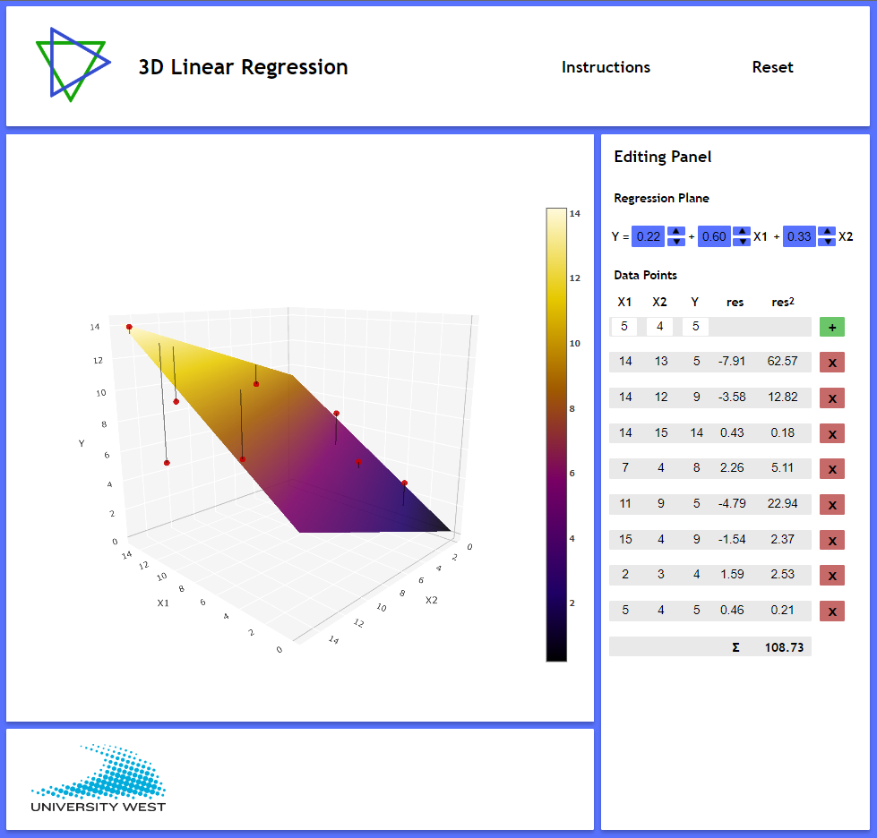

# 3D Linear Regression Application

This application is made to display and calculate a 3D Linear Regression model. It uses local html, css and js files. The application is run locally with a browser and all dependencies are local.

The application consists of a 3D model of a regression plane. The model can be manually fed with data point values that are then displayed in the model. The model’s size will grow accordingly to the positioning of the data points. 

A residual value is calculated for each data point in accordance with its distance in the y-axis(z) from the regression plane. This value is also calculated as a square and all such values are combined into a sum. The lowest sum of these squared residual values indicates that the current configuration of the regression plane is the one that most correctly displays the correlations between the values represented on each axis.

Further instructions are available inside the application under the "instructions" button in the top menu.

# Startup

The application is run entirely locally and you only need access to a browser. Double click on the "index.html" file to start the application. If this however opens a text editor or similar application choose instead the "Open with" option when right-clicking on the "index.html" file and select a browser from the list.

# Limitations

The data points cannot exceed 700,700,700 on the different axis (x1, x2, y). This is because the application struggles to present values larger than this as the application must calculate and place each individual spot coordinate in the regression plane. 

There is also no way to store any data in the app which means the data must be manually fed each time.